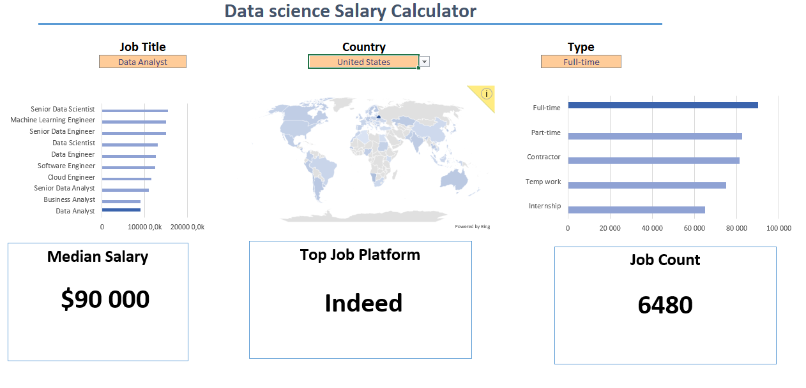
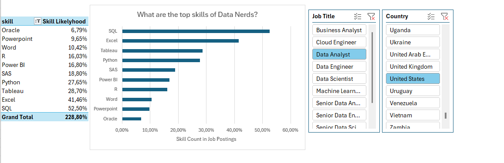
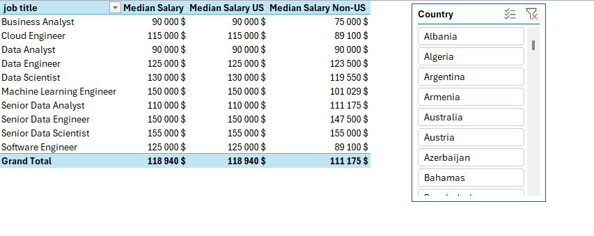
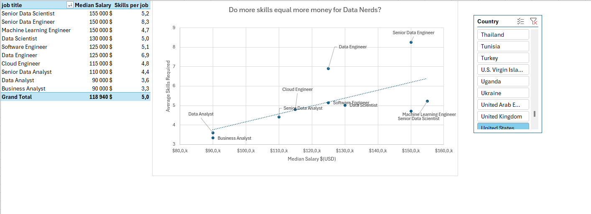
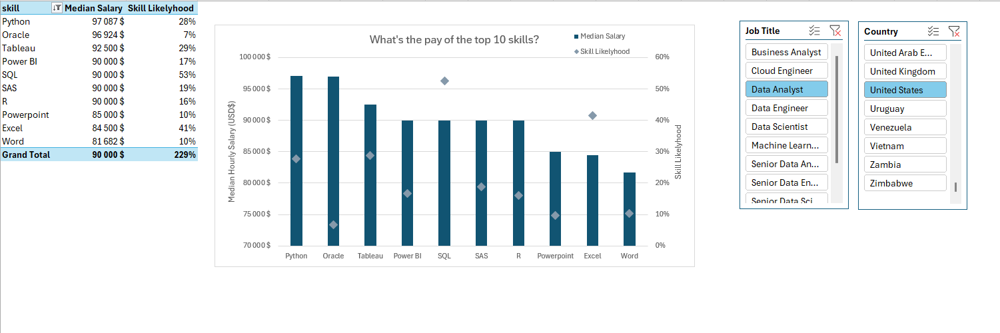

# Excel for Data Analysis 

As part of the Excel fro Data analytics course built by Luke Barousse and Kelly Adams, we built two projects.
The data set provided included thousands of job postings from the data filed and data field adjacent jobs.

## Projet #1 : Data Science Salary Calculator

The first project consisted of building an interactive **_Data Science Salary Calculator_** to find the median salary of the selected job titles. The dashboard user could filter its search by job title, job country and schedule type. Then, the user would find the median salary, the amount oof postings in the data base for said job title and the website with the most postings for the type of work.

This dashboard was built using solely formulas, functions as well as vizualisations.
This project was meant to apply knowledge acquired during the first part of the course and help with Excel etiquette when it comes to sharing documentation with a team.

We used formulas such as **XLOOKUP**, **MEDIAN**, **SORT**, **IF**, etc. We also learned to build graphs and tables. We learned how to lock cells, hide tabs and columns.

## Project 2: Building analysis

The second half of the course was focused on more advanced tools such as pivot tables, power query and power pivot.
These tools were used to build various analysis of the data set. We used a mix of tables, graphs and slicers to nagivate and vizualise the data set. We interconnected the slicers from the different tabs.

### Analysis the necessity of specific skills depending on the job title.

### Analysis of the median salary of a specific set of job titles by selected country compared to the US median salary and the median salary excluding the US.

### Analysis on the median salary of specific set of jobs correlating to amount of skills to have for said jobs.

### Analysis on the likelyhood of needing a specific set of skills and the median salary of having said skills.

# Conclusion:

These project and this course gave me tools to use excel efficiently to summarize, analyze and clean up data. This skill was useful when I started learning SQL shortly after finishing this course. It is a great tool to clean up data sets in power query before uploading them to postgresql.
